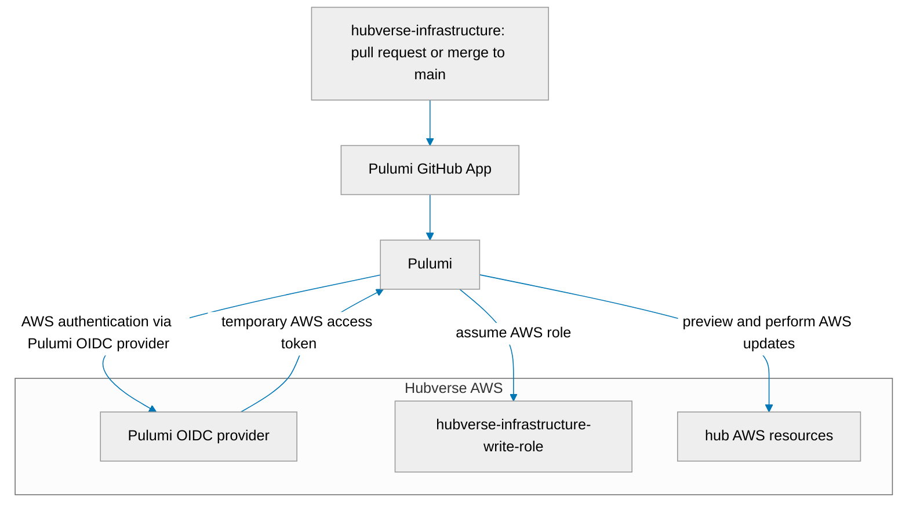

# Hubverse Infrastructure


This repository uses [Pulumi](https://www.pulumi.com/) to provision cloud resources for the Hubverse, a project that
provides open tools for collaborative modeling: [https://hubverse.io/en/latest/](https://hubverse.io/en/latest/).

## Background

### Hubverse cloud integration

At this time, the Hubverse is able to provide hosting for hubs that are interested in mirroring their data on the cloud.
Specifically, we can provision the required Amazon Web Services (AWS) resources and provide hub administrators with a
GitHub action that will securely sync their model output, target data, and configuration files to a designated S3 bucket.

The `hubverse-infrastructure` repository contains the [Pulumi](https://www.pulumi.com/)-based infrastructure-as-code
project that manages hub-supporting AWS components.

The code here uses a YAML file that lists the cloud-enabled hubs.
For each hub listed in the file, the Pulumi entry point invokes a Python function that provisions the required
AWS resources.

### AWS

Amazon Web Services (AWS) is the only cloud provider supported by Hubverse hosting.

The code in this repository creates two categories of AWS resources:

1. Resources that are shared across all hubs or are used for Hubverse administration.
2. Resources created specifically for each hub.

#### Shared cloud resources

These resources are created one time for the entire Hubverse:

1. As S3 bucket to store shared files. The contents are not publicly accessible because they are for internal use.
2. An AWS lambda function that transforms model-output files into a standardized format.

#### Hub-specific cloud resources

Each cloud-enabled hub requires several dedicated AWS resources. These resources are created for each hub:

1. An S3 bucket to store data. Hubverse S3 buckets:
   - are versioned
   - allow anonymous public read access to contents
   - have a CORS policy that allows http access to bucket contents
2. An IAM _role_ that can be assumed by GitHub Actions. This role has two associated _policies_:
    - A _trust policy_ that stipulates the role can only be used by GitHub Actions originating from the main branch
      of the hub's repository.
    - A _permission policy_ that grants write access to the hub's S3 bucket.

## Onboarding a hub

Other than the ability to submit a PR to this repository, no special permissions are required for onboarding a hub to
the Hubverse AWS account.

To begin syncing an existing Hubverse hub to S3:

1. Add a new `hub` entry to [`hubs.yaml`](src/hubverse_infrastructure/hubs/hubs.yaml):
    - `hub` key: the name of the hub (this value will be used as the S3 bucket name, so make sure it's something unique)
    - `org`:  the GitHub organization that hosts the hub's repository
    - `repo`: the name of the hub's repository

    For example:

    ```yaml
    - hub: flusight-forecast
      org: cdcepi
      repo: FluSight-forecast-hub
    ```

2. Submit the above changes as a pull request (PR) to this repository.
3. Shortly after the PR is opened, Pulumi will add a comment about the AWS changes it will make once the PR is merged.

    For example:

    ```bash
        Name                                             Type                                                Operation
    +   flusight-forecast                                aws:iam/role:Role                                      create
    +   flusight-forecast-write-bucket-policy            aws:iam/policy:Policy                                  create
    +   flusight-forecast-allow                          aws:lambda/permission:Permission                       create
    +   flusight-forecast-transform-model-output-lambda  aws:iam/rolePolicyAttachment:RolePolicyAttachment      create
    +   flusight-forecast                                aws:s3/bucket:Bucket                                   create
    +   flusight-forecast-read-bucket-policy             aws:s3/bucketPolicy:BucketPolicy                       create
    +   flusight-forecast                                aws:iam/rolePolicyAttachment:RolePolicyAttachment      create
    +   flusight-forecast-public-access-block            aws:s3/bucketPublicAccessBlock:BucketPublicAccessBlock create
    +   flusight-forecast-create-notification            aws:s3/bucketNotification:BucketNotification           create
    ```

4. If the Pulumi preview looks good, the PR can be merged after a code review. Once the PR is merged, Pulumi will apply
   the AWS changes.
5. The hub is now hosted in the Hubverse AWS account.

> [!IMPORTANT]
> The value of `hub` in `hubs.yaml` must match the value of `cloud.host.storage_location` in the hub's `admin.json`
> configuration file. The `org` and `repo` fields are used to create permissions that allow the hub's GitHub workflow
> to sync data to s3. If these values are not correct, the workflow will fail.

## Permissions

This section provides an overview of the GitHub, Pulumi, and AWS components that enable us to manage infrastructure via
the code in this repository. Additionally, there are instructions for updating those components if necessary. For
example:

- We want to manage a new type of AWS resource via Pulumi and need to update AWS permissions accordingly
- We want to update the configuration of our Pulumi deployments (_e.g._, change the triggering branch, update the
  session duration of Pulumi's temporary AWS credentials)

### Overview

The Hubverse uses [Pulumi's GitHub app](https://www.pulumi.com/docs/iac/using-pulumi/continuous-delivery/github-app/)
to deploy infrastructure changes to AWS. The app is installed on the
[`hubverse-org` GitHub organization](https://github.com/hubverse-org) and currently has access to this repository.
Only a hubverse-org administrator can change the Pulumi GitHub app settings.

The GitHub app initiates a deployment process when:

- A PR is opened against the this repo's `main` branch (for previewing changes)
- A PR is merged into the `main` branch (for applying changes)

These deployments are configured to use the Pulumi OIDC identity provider created in our Hubverse AWS account. The OIDC
provider allows Pulumi to request temporary AWS credentials and assume the following AWS role when performing previews
and updates:

- `hubverse-infrastructure-write-role`

The combination of Pulumi's GitHub app and the Pulumi OIDC identity provider in the Hubverse AWS account means that
this repository does not need to store any secrets or tokens to initiate infrastructure changes.



### Pulumi configuration

The Hubverse has an [open source team edition](https://github.com/pulumi/team-edition-for-open-source/issues/26) of
Pulumi, which gives us access to automated CI/CD deployments and allows us to have a team of up to 10 members.

To view the Hubverse's Pulumi-managed resources, you will need to create a Pulumi account and be added to the Pulumi
hubverse organization by an existing administrator. As a team member, you will have access to:

- `hubverse-aws`: the [Pulumi project](https://www.pulumi.com/docs/iac/concepts/projects/) the corresponds to this
  repository. Project configuration is managed in [`Pulumi.yaml`](Pulumi.yaml).
- `hubverse`: the [Pulumi stack](https://www.pulumi.com/docs/iac/concepts/stacks/) that contains the production
  AWS resources managed by Pulumi. A Pulumi project can contain multiple stacks, but we only use one. Stack settings
  are managed in [`Pulumi.hubverse.yaml`](Pulumi.hubverse.yaml).
- [Pulumi deployments](https://www.pulumi.com/docs/pulumi-cloud/deployments/): events that represent a preview of
  proposed infrastructure updates or a log of completed infrastructure updates. Deployments are triggered by GitHub
  pull requests and merges.

Each Pulumi stack has settings that control deployment behavior. For example:

- `source control settings`: the GitHub repository and branch that trigger deployments (in our case, the `main` branch
  of `hubverse-infrastructure`)
- `GitHub settings`: what actions should trigger a deployment (_e.g._, run a preview when someone opens a PR)
- `Pre-run commands`: commands to run before a deployment (we use these commands to install Python dependencies)
- `OpenID Connect`: identifier (ARN) of the OIDC provider that Pulumi uses to authenticate to AWS

If any of the above changes, you will need to update the `hubverse/hubverse-aws` deployment settings.

### Updating Pulumi's AWS permissions

If a Pulumi deployment returns a 403 error, it's likely the Pulumi code is trying to make a change that the AWS IAM
`hubverse-infrastructure-write-role` role doesn't have permission to make.

`hubverse-infrastructure-write-role` is attached to an IAM policy that describes what it's allowed to do:

- `hubverse-infrastructure-write-policy`.

The hubverse-infrastructure role and policies are managed outside of Pulumi. Thus, to grant additional permissions
required for Pulumi operations, you will need to update `hubverse-infrastructure-write-policy` via the AWS console:

1. Log in to the AWS console.
2. Click on _Services_ in the top left corner, and then click on _IAM_.
3. From the _IAM_ dashboard, find the _Access management_ section in the left-hand menu and click on _Policies_.
4. When the list of policies appears, use the search box to find `hubverse-infrastructure-write-policy` and click on it.
5. Click the _Edit_ button to update the policy.

> [!IMPORTANT]
> To make these changes, you will need a Hubverse AWS login with:
>
> - console permission
> - policy update permissions

## Local development

See [CONTRIBUTING.md](CONTRIBUTING.md) for instructions on setting up a local development environment.
