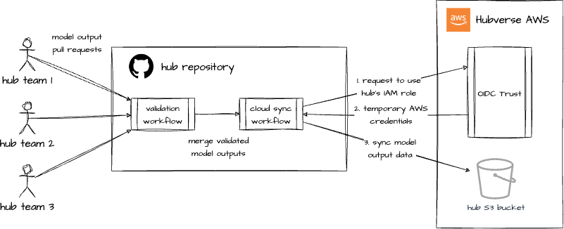

# Hubverse Infrastructure

**WIP Status**

This repository contains the code needed to provision cloud resources for Hubverse hubs that would like
to store their data in the cloud.

Hubs that opt-in to Hubverse Cloud should expect the following during the initial phase of this project:

- The data submission process will not change.
- Whenever a pull request is merged into the hub repository's main branch, a GitHub Action workflow will
   sync data from the following hub folders to an S3 bucket:
    - hub-config
    - model-metadata
    - model-output
- Each hub will have its own S3 bucket, and the data will stored there will be publicly available (read-only).
- Existing Hubverse clients for accessing data (_e.g._, `hubUtils`) will be able to read data from the S3 bucket.

## Hubverse Cloud Integration

At this time, the Hubverse will provide hosting for hubs that opt-in to cloud storage. This may change in the future, but as the Hubverse Cloud work gets started, we want to minimize onboarding friction for hub administrators.

Because the Hubverse uses GitHub as the interface for submitting model output data, cloud-enabled hubs will use a GitHub Actions workflow to sync submissions to the cloud. The GitHub repositories for these hubs, therefore, will need access to the relevant cloud resources (for example, GitHub will need permission to write data to a hub's cloud storage).

To provide this access without storing long-lived secrets in Hubverse repositories, we've chosen to use OpenID Connect (OIDC) for authentication. 

It's not important for Hubverse admins to know the details of OIDC, but below is a high-level overview of how it works. Essentially, Github will request temporary credentials from a cloud provider. The provider, in turn,  will grant these credentials if the request is signed correctly and originates from the main branch of the correct repo.

[This article](https://docs.github.com/en/actions/deployment/security-hardening-your-deployments/about-security-hardening-with-openid-connect) has more information about the benefits of using OIDC to integrate with cloud providers.

## Supported Cloud Providers

At this time, the Hubverse supports:

- AWS

### AWS

The Hubverse AWS account has an account-wide OpenID Connect (OIDC) identity provider configured for use by GitHub Actions.

Each cloud-enabled hub requires the following AWS resources:

1. An S3 bucket to store data (with public read access).
2. An IAM _role_ that can be assumed by GitHub Actions. This role has two associated _policies_:
    - A _trust policy_ that stipulates the role can only be used by GitHub Actions that originate from the main branch of the hub's repository.
    - A _permission policy_ that grants write access to the hub's S3 bucket.

Below is a simplified version of how GitHub and AWS interact to securely move hub data to its cloud storage:

## Infrastructure as Code

Using a per-hub permissions model requires a set of tightly-integrated cloud resources. Using code to manage these resources (as opposed to creating them manually via a cloud provider's UI) provides several advantages:

- Minimizes the potential for human error
- Allows us to source control our cloud infrastructure management
- Displays proposed changes to cloud infrastructure before they're applied

We haven't yet made a final decision on the Hubverse's Infrastructure as Code (IaC) tool. At this time, we have a working prototype that uses Pulumi. More information about how to use it can be found in [Pulumi](pulumi).